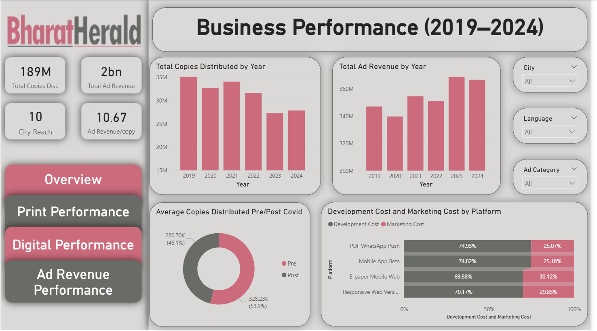

# Business-Performance-of-Bharat-Herald-newspaper-post-COVID
This project analyses the impact of COVID on the print media industry and highlights the inevitable shift toward digital platforms.

# Problem statement
The COVID-19 pandemic accelerated the decline of print media and disrupted Bharat Herald’s traditional business model. The company now faces declining circulation, uneven digital adoption, and inefficient marketing spend, creating an urgent need for a data-driven digital growth strategy.

# Tools Used
- MySQL
- PowerBI

# Key Insights
- Print circulation declined structurally after COVID, falling from 35M to ~28M copies by 2024.
- 2022 recorded the sharpest year-on-year drop in circulation (–6.3%), marking the peak impact of COVID.
- High-circulation cities were hit hardest and have not returned to pre-pandemic levels.
- Tier 2 states experienced the steepest decline in newspaper sales.
- Ad revenue rebounded by ₹20M by 2024, proving advertiser confidence despite lower print volume.
- Digital pilot programs show high early churn (66%), indicating weak retention.
- Ahmedabad and Lucknow outperform in digital adoption despite lower marketing spend.
- Higher marketing spend does not ensure higher engagement, as efficiency is lowest in the most expensive digital program.

# Recommendations
- Transition to a digital-first growth strategy while gradually reducing dependency on print circulation.
- Prioritize high-performing digital cities such as Ahmedabad, Bhopal, and Lucknow for scaling.
- Strengthen and scale the Mobile App Beta as the core digital platform.
- Optimize marketing spend using ROI and engagement metrics rather than increasing budgets.
- Protect print operations only in resilient cities and exit low-return markets to improve profitability.

# Interactive Dashboards
link: (https://app.powerbi.com/groups/me/reports/a49fbe62-034a-482e-8dd7-019d7a8b1e37/bce4642b1166718eda7d?experience=power-bi)

## Overview

## Print Performance

## Digital Performance

## Ad Revenue Performance

